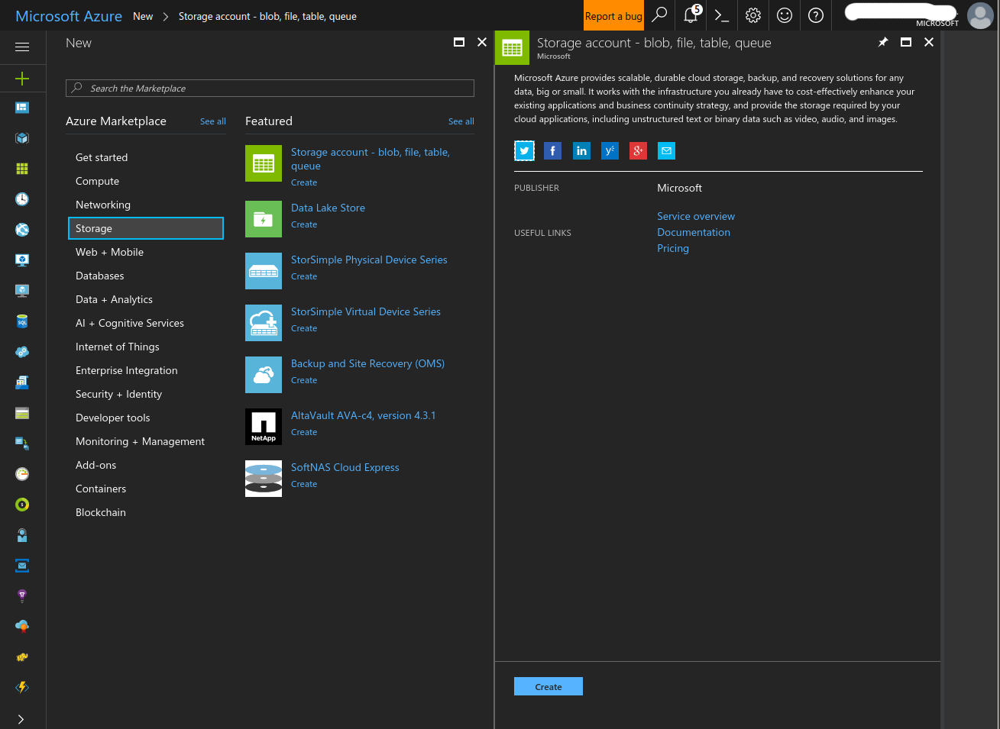
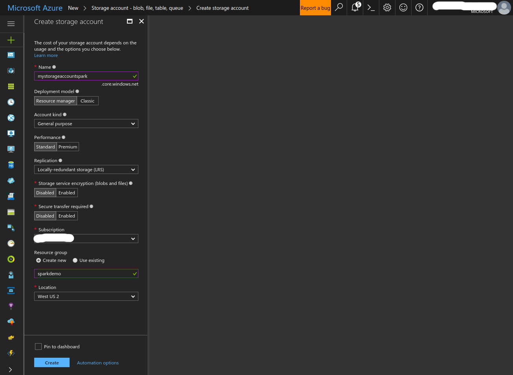
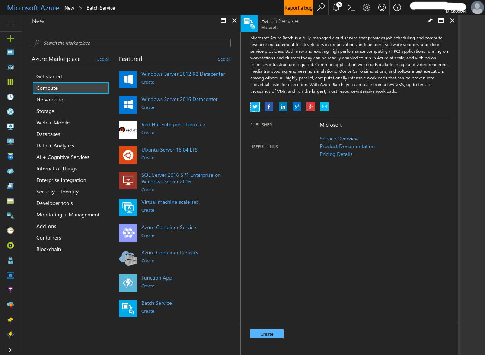
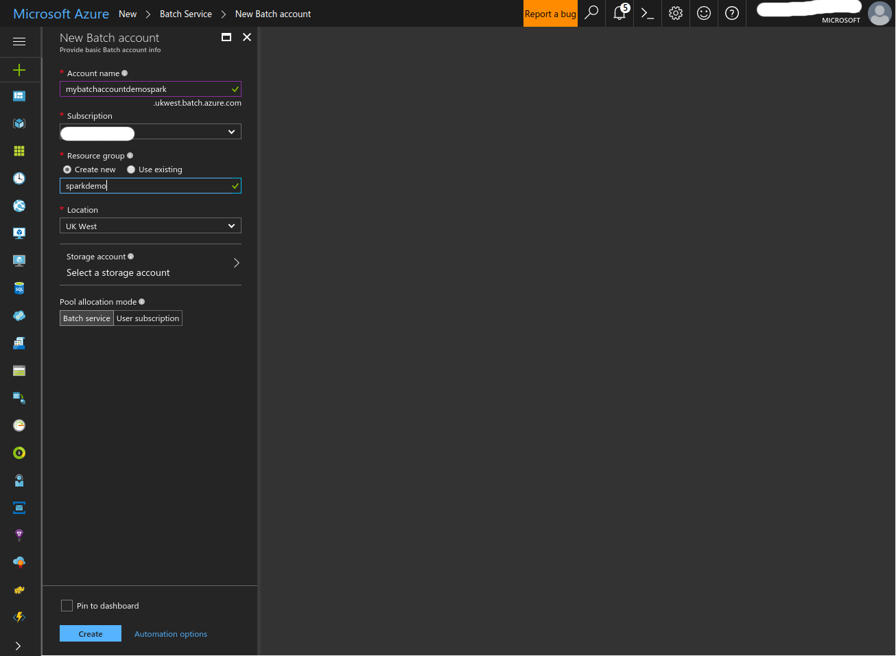
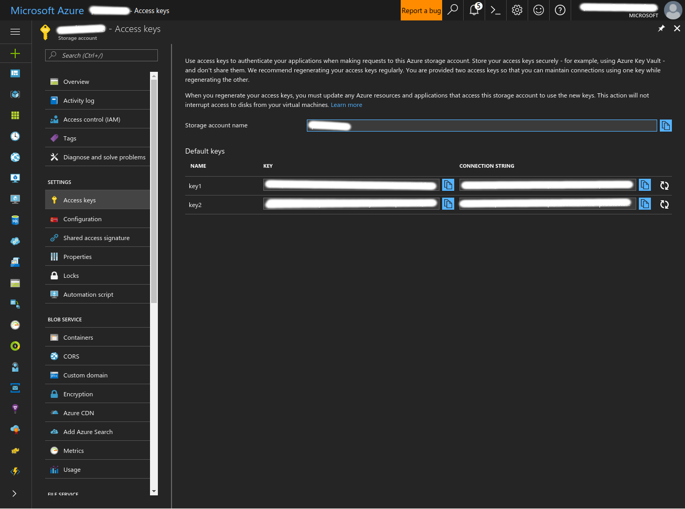
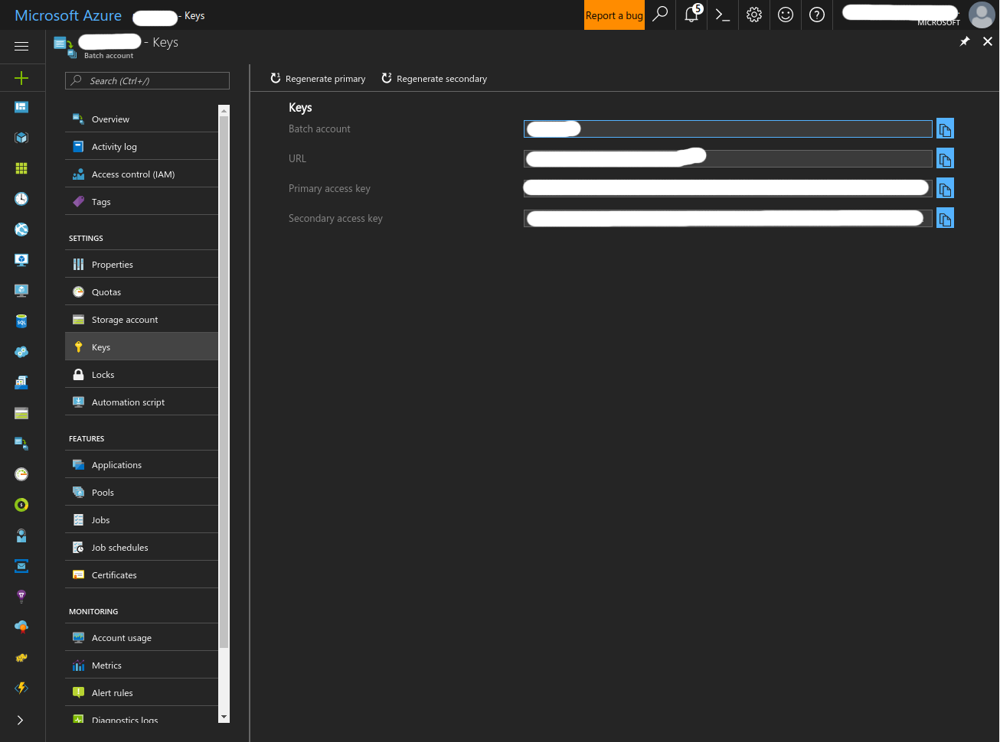

# Azure Distributed Data Engineering Toolkit
The Azure Distributed Data Engineering Toolkit is a project that allows Sparks users to easily spin up a Spark cluster in Azure.

## Getting Started
The minimum requirements to get started with this package are:
- Python 3.5+, pip 9.0.1+
- An Azure account
- An Azure Batch account
- An Azure Storage account

### Cloning and installing the project
1. Clone the repo
2. Make sure you are running python 3.5 or greater.
    _If the default version on your machine is python 2 make sure to run the following commands with **pip3** instead of **pip**._

3. Use pip to install required packages:
    ```bash
    pip install -r requirements.txt
    ```

4. Use setuptools to install the required biaries locally:
    ```bash
    pip install -e .
    ```
5. Initialize your environment:
    
    Navigate to the directory you wish to use as your spark development environment, and run:
    ```bash
    aztk spark init
    ```
    This will create a *.aztk* folder with preset configuration files in your current working directory.

### Setting up your accounts
To finish setting up, you need to fill out your Azure Batch and Azure Storage secrets in *.aztk/secrets.yaml*. We'd also recommend that you enter SSH key info in this file too.

Please note that if you use ssh keys and a have a non-standard ssh key file name or path, you will need to specify the location of your ssh public and private keys. To do so, set them as shown below:
```yaml
default:
    # SSH keys used to create a user and connect to a server.
    # The public key can either be the public key itself(ssh-rsa ...) or the path to the ssh key.
    # The private key must be the path to the key.
    ssh_pub_key: ~/.ssh/my-public-key.pub
    ssh_priv_key: ~/.ssh/my-private-key
```

To get the required keys for Azure Batch and Azure Storage, please follow the below instructions:

1. Log into Azure
If you do not already have an Azure account, go to [https://azure.microsoft.com/](https://azure.microsoft.com/) to get started for free today.

   Once you have one, simply log in and go to the [Azure Portal](https://portal.azure.com) to start creating your Azure Batch account and Azure Storage account.

2. Create a Storage account

- Click the '+' button at the top left of the screen and search for 'Storage'. Select 'Storage account - blob, file, table, queue' and click 'Create'



- Fill in the form and create the Storage account.



3. Create a Batch account

- Click the '+' button at the top left of the screen and search for 'Compute'. Select 'Batch' and click 'Create'



- Fill in the form and create the Batch account.



4. Save your account credentials into the secrets.yaml file

- Open the secrets.yaml file in the *.aztk* folder in your current working directory (if *.aztk* doesn't exist, run `aztk spark init`). Fill in all of the fields as described below.

- Go to the accounts in the Azure portal and copy pase the account names, keys and other information needed into the
secrets file.

#### Storage account

For the Storage account, copy the name and one of the two keys:



#### Batch account

For the Batch account, copy the name, the url and one of the two keys:




## Next Steps
- [Create a cluster](./10-clusters.md)
- [Run a Spark job](./20-spark-submit.md)
